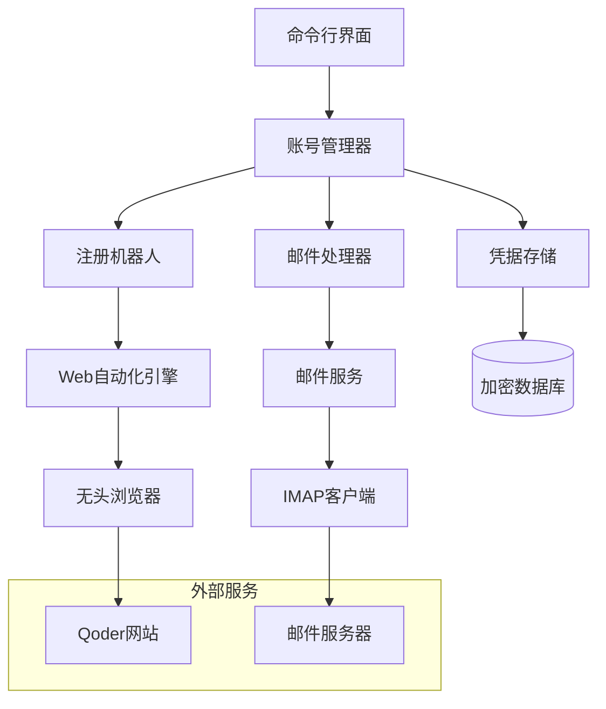

# 设计文档：Qoder账号管理器

## 概述

Qoder账号管理器是一个基于Node.js的自动化工具，使用域名邮箱地址简化Qoder账号的注册和管理过程。系统结合了Web浏览器自动化、邮件处理和安全凭据管理，为批量账号配置提供了全面的解决方案。

架构采用模块化设计，职责分离明确：Web自动化处理注册过程，邮件处理管理验证工作流，凭据管理确保账号信息的安全存储和检索。

## 架构

系统采用分层架构，包含以下主要组件：



**核心组件：**
- **账号管理器**: 管理整个注册工作流的中央协调器
- **注册机器人**: 处理Web自动化和表单提交
- **邮件处理器**: 管理邮件检索和验证链接提取
- **凭据存储**: 提供账号凭据的安全存储和检索
- **Web自动化引擎**: 使用Playwright进行浏览器自动化，确保可靠性和现代Web支持

## 组件和接口

### 账号管理器
协调注册过程的中央协调器。

**接口：**
```javascript
class AccountManager {
    async registerSingleAccount(email, config) // 返回 RegistrationResult
    async registerBatchAccounts(emails, config) // 返回 BatchResult
    async getStoredCredentials(email) // 返回 AccountCredentials 或 null
    async exportCredentials(outputPath) // 返回 boolean
}
```

**职责：**
- 协调组件间的注册工作流
- 实施速率限制和重试逻辑
- 维护注册进度和日志记录
- 处理带错误恢复的批量处理

### 注册机器人
处理Qoder注册过程的所有Web自动化任务。

**接口：**
```javascript
class RegistrationBot {
    async navigateToRegistration() // 返回 boolean
    async fillRegistrationForm(email, password, profile) // 返回 boolean
    async handleCaptcha() // 返回 boolean
    async submitRegistration() // 返回 RegistrationStatus
    async detectRegistrationErrors() // 返回 string 或 null
}
```

**实现细节：**
- 使用Playwright进行跨浏览器兼容性和现代Web功能
- 实施动态内容的智能等待策略
- 处理各种反机器人措施，包括验证码
- 支持无头和可见模式进行调试
- 包含错误诊断的截图捕获

### 邮件处理器
管理邮件检索和验证链接处理。

**接口：**
```javascript
class EmailProcessor {
    async connectToMailbox(emailConfig) // 返回 boolean
    async waitForVerificationEmail(email, timeout) // 返回 VerificationEmail 或 null
    async extractVerificationLink(emailContent) // 返回 string 或 null
    async completeEmailVerification(verificationLink) // 返回 boolean
}
```

**实现细节：**
- 使用Node.js的imap库进行IMAP连接，支持POP3回退
- 使用cheerio实现HTML内容的智能邮件解析
- 支持多个邮件提供商的特定配置
- 包含临时邮件服务器问题的重试逻辑
- 维护邮件处理历史以避免重复处理

### 凭据存储
提供账号凭据的安全存储和管理。

**接口：**
```javascript
class CredentialStore {
    async storeCredentials(email, password, metadata) // 返回 boolean
    async retrieveCredentials(email) // 返回 AccountCredentials 或 null
    async listAllAccounts() // 返回 string[]
    async backupCredentials(backupPath) // 返回 boolean
    async restoreCredentials(backupPath) // 返回 boolean
}
```

**实现细节：**
- 使用SQLite进行加密本地存储
- 实施AES-256密码存储加密
- 使用PBKDF2支持安全密钥派生
- 包含自动备份功能
- 为所有凭据操作提供审计日志

## 数据模型

### 核心数据结构

```javascript
class RegistrationConfig {
    constructor(emailConfig, userProfile, automationSettings, retrySettings) {
        this.emailConfig = emailConfig;
        this.userProfile = userProfile;
        this.automationSettings = automationSettings;
        this.retrySettings = retrySettings;
    }
}

class EmailConfig {
    constructor(imapServer, imapPort, username, password, useSSL, folder = "INBOX") {
        this.imapServer = imapServer;
        this.imapPort = imapPort;
        this.username = username;
        this.password = password;
        this.useSSL = useSSL;
        this.folder = folder;
    }
}

class UserProfile {
    constructor(firstName, lastName, company, country, timezone) {
        this.firstName = firstName;
        this.lastName = lastName;
        this.company = company;
        this.country = country;
        this.timezone = timezone;
    }
}

class RegistrationResult {
    constructor(email, success, accountId, password, errorMessage, timestamp, verificationCompleted) {
        this.email = email;
        this.success = success;
        this.accountId = accountId;
        this.password = password;
        this.errorMessage = errorMessage;
        this.timestamp = timestamp;
        this.verificationCompleted = verificationCompleted;
    }
}

class AccountCredentials {
    constructor(email, password, accountId, createdAt, lastVerified, metadata) {
        this.email = email;
        this.password = password;
        this.accountId = accountId;
        this.createdAt = createdAt;
        this.lastVerified = lastVerified;
        this.metadata = metadata;
    }
}
```

### 数据库模式

```sql
CREATE TABLE accounts (
    id INTEGER PRIMARY KEY AUTOINCREMENT,
    email TEXT UNIQUE NOT NULL,
    encrypted_password BLOB NOT NULL,
    account_id TEXT,
    created_at TIMESTAMP DEFAULT CURRENT_TIMESTAMP,
    last_verified TIMESTAMP,
    metadata TEXT,
    salt BLOB NOT NULL
);

CREATE TABLE registration_logs (
    id INTEGER PRIMARY KEY AUTOINCREMENT,
    email TEXT NOT NULL,
    action TEXT NOT NULL,
    status TEXT NOT NULL,
    error_message TEXT,
    timestamp TIMESTAMP DEFAULT CURRENT_TIMESTAMP,
    FOREIGN KEY (email) REFERENCES accounts (email)
);
```

## 正确性属性

*属性是在系统的所有有效执行中都应该成立的特征或行为——本质上是关于系统应该做什么的正式声明。属性作为人类可读规范和机器可验证正确性保证之间的桥梁。*

### 属性1: 注册流程启动
*对于任何*有效的域名邮箱地址，当提供给注册机器人时，系统应成功启动Qoder注册流程并导航到注册表单。
**验证: 需求 1.1**

### 属性2: 表单字段填充
*对于任何*遇到的注册表单，注册机器人应根据提供的用户配置文件自动填充所有必填字段。
**验证: 需求 1.2**

### 属性3: 邮件验证往返
*对于任何*邮件验证过程，系统应成功监控收件箱、提取验证链接并自动完成验证。
**验证: 需求 1.3, 2.2, 2.3**

### 属性4: 凭据存储和检索
*对于任何*成功的注册，存储的凭据应可检索并与原始账号信息匹配，所有密码都应正确加密。
**验证: 需求 1.4, 3.2, 3.3, 3.4**

### 属性5: 综合错误处理
*对于任何*错误条件（注册失败、网络错误、邮件解析错误、浏览器故障），系统应记录详细的错误信息并实施适当的恢复策略。
**验证: 需求 1.5, 2.5, 8.1, 8.2, 8.3, 8.4**

## 错误处理

系统实施多层错误处理策略：

### 浏览器自动化错误
- **页面加载失败**: 实施指数退避和可配置重试限制
- **元素未找到**: 使用智能等待策略和多选择器回退
- **验证码检测**: 集成验证码解决服务或手动干预工作流
- **速率限制**: 检测HTTP 429响应并实施适当延迟

### 邮件处理错误
- **连接失败**: 指数退避重试，支持多邮件服务器配置
- **解析错误**: 实施强大的HTML/文本解析和回退策略
- **验证超时**: 可配置超时期间和重试机制
- **认证错误**: 清晰的错误报告和凭据验证

### 数据存储错误
- **加密失败**: 验证加密密钥并提供清晰的错误消息
- **数据库损坏**: 实施数据库完整性检查和修复机制
- **备份失败**: 验证备份完整性并提供回滚功能
- **并发访问**: 使用数据库锁定防止数据损坏

## 测试策略

测试策略采用双重方法，结合单元测试处理特定场景和基于属性的测试进行全面覆盖。

### 单元测试方法
单元测试专注于特定示例、边界情况和集成点：

- **组件集成**: 测试账号管理器、注册机器人、邮件处理器和凭据存储之间的交互
- **错误条件**: 测试特定错误场景，如网络超时、无效邮件格式和数据库损坏
- **配置验证**: 测试各种配置组合和验证逻辑
- **安全功能**: 测试加密/解密、密码生成和安全存储机制

### 基于属性的测试配置
基于属性的测试使用**fast-check**验证所有输入的通用属性：

- 每个属性测试**最少100次迭代**以确保全面的输入覆盖
- 为域名邮箱、用户配置文件和配置对象提供**自定义生成器**
- 多步注册工作流的**状态测试**
- **收缩策略**以识别最小失败示例

每个属性测试必须用引用其设计文档属性的注释标记：
```javascript
// 功能: qoder-account-manager, 属性1: 注册流程启动
function testRegistrationInitiationProperty(domainEmail) {
    // 测试实现
}
```

测试框架确保特定示例正确工作（单元测试）并且通用属性在所有可能输入中保持（属性测试），提供系统正确性的全面验证。